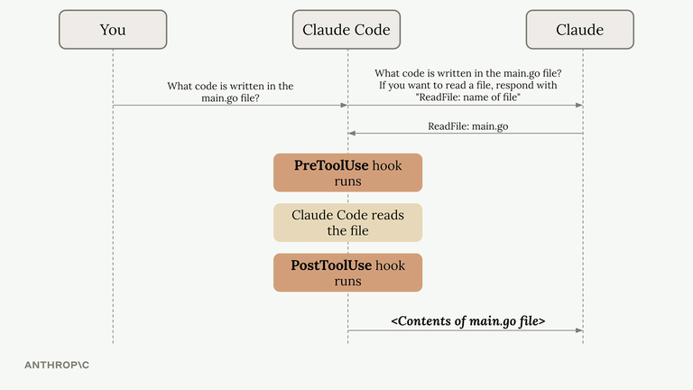
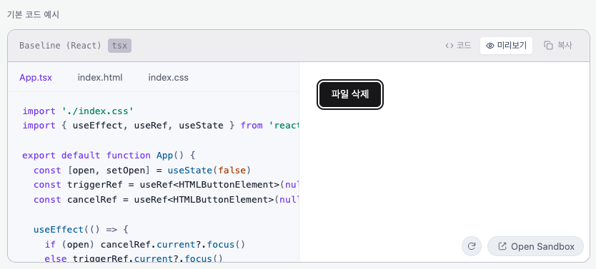
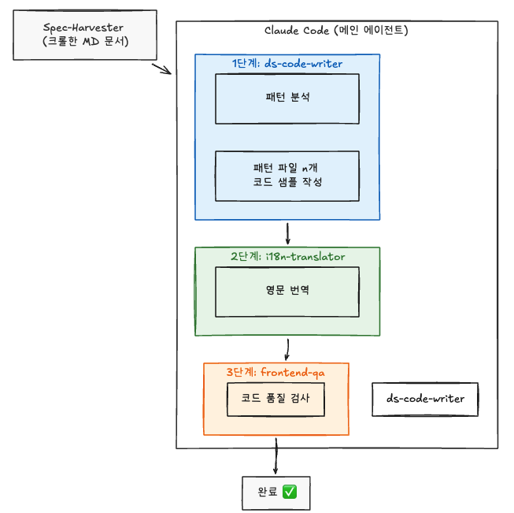
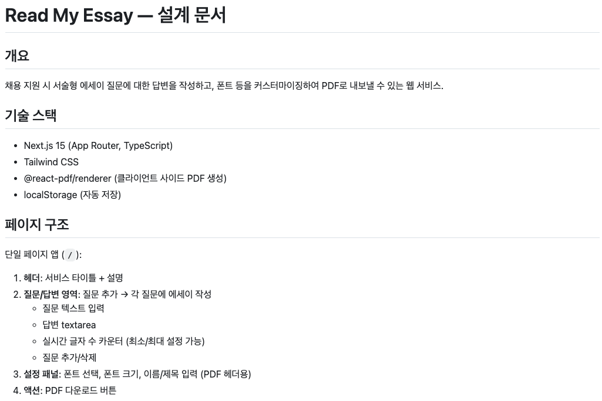
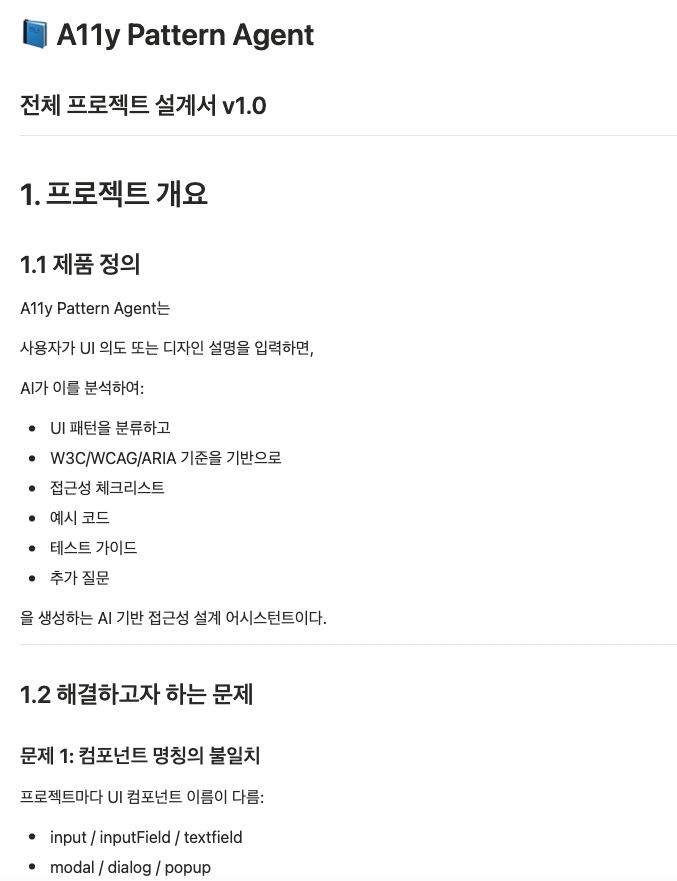

# Week 1: Claude Code 활용 사례 공유

## 개요

Modac 스터디 이전부터 3개 프로젝트에서 Claude Code를 사용하며 구축한 자동화 파이프라인과 커스터마이징 사례를 공유합니다.

| 프로젝트                 | 설명                        | 스택                                           |
| ------------------------ | --------------------------- | ---------------------------------------------- |
| **design-system**        | 디자인 시스템               | pnpm + Turborepo + Vanilla Extract + Storybook |
| **a11y-references-site** | 접근성 패턴 레퍼런스 사이트 | Next.js 14 + Fastify + Sandpack                |
| **python-crawler**       | 접근성 스펙 크롤러          | Python CLI                                     |

---

## 목차

- [1. Hooks — Claude가 실수하지 않도록](#1-hooks-claude가-실수하지-않도록)
- [2. Commands — 반복 작업을 더 쉽게 사용할 수 있도록](#2-commands-반복-작업을-더-쉽게-사용할-수-있도록)
- [3. Rules — 프로젝트별 코드 작성 규칙 주입](#3-rules-프로젝트별-코드-작성-규칙-주입)
- [4. Agents — 특정한 작업을 위한 독립된 컨텍스트를 가진 서브 에이전트](#4-agents-특정한-작업을-위한-독립된-컨텍스트를-가진-서브-에이전트)
- [5. Skills — 재사용 가능한 워크플로우를 정의하여 사용](#5-skills-재사용-가능한-워크플로우를-정의하여-사용)
- [6. Plugins — 커뮤니티/공식 확장을 통해 더 많은 기능을 사용할 수 있도록](#6-plugins-커뮤니티공식-확장을-통해-더-많은-기능을-사용할-수-있도록)
- [7. 전체 아키텍처 요약](#7-전체-아키텍처-요약)
- [8. 최근 업무 방식](#8-최근-업무-방식)

## 1. Hooks — Claude가 실수하지 않도록

Claude Code의 Hooks는 도구 실행 전후에 자동으로 스크립트를 실행하는 기능입니다.

<p align="center">
    
</p>

> PreToolUse(실행 전 차단)와 PostToolUse(실행 후 검증) 두 시점에 훅을 걸어 Claude의 동작을 제어합니다.

저는 **전역 훅 2개 + 프로젝트별 훅**을 조합해서 사용하고 있습니다.

전역 훅에서는 전반적으로 위험한 명령을 차단, 민감한 파일을 보호하고, 프로젝트별 훅에서는 프로젝트별 규칙을 적용합니다.

### 1-1. 전역 훅: 위험 명령 차단 [(`block-dangerous-commands.js`)](/global/.claude/hooks/block-dangerous-commands.js)

**위치:** `~/.claude/hooks/` (PreToolUse → Bash)

Claude가 Bash 명령을 실행하기 **전에** 위험한 패턴을 검사하고 차단합니다.

```
┌─────────────────────────────────────────────────────────┐
│  CRITICAL — rm ~/, rm /, fork bomb, dd to disk, mkfs    │
│  HIGH     — curl|sh, force push main, git reset --hard  │
│  STRICT   — force push any, git checkout ., sudo rm     │
└─────────────────────────────────────────────────────────┘
```

**동작 예시:**

- `rm -rf ~/` → 🚨 즉시 차단
- `curl https://... | sh` → ⛔ RCE 위험으로 차단
- `git push --force origin main` → ⛔ main 브랜치 force push 차단

차단된 명령은 `~/.claude/hooks-logs/{날짜}.jsonl`에 기록됩니다.

**핵심 구조:**

```js
// safety level에 따라 차단 범위 조절
const SAFETY_LEVEL = "high"; // critical + high + strict 모두 차단

const PATTERNS = [
  {
    level: "critical",
    id: "rm-root",
    regex: /\brm\s+(-.+\s+)*\/(\*|\s|$)/,
    reason: "rm targeting root",
  },
  {
    level: "high",
    id: "git-force-main",
    regex: /\bgit\s+push\b.+(--force|-f).+\b(main|master)\b/,
    reason: "force push to main",
  },
  // ...
];
```

### 1-2. 전역 훅: 비밀 파일 보호 [(`protect-secrets.js`)](/global/.claude/hooks/protect-secrets.js)

**위치:** `~/.claude/hooks/` (PreToolUse → Read|Edit|Write|Bash)

Claude가 `.env`, SSH 키, AWS credentials 같은 민감한 파일에 접근하려 할 때 차단합니다.

> 이는 단순히 접근 뿐만을 넘어서 학습을 통해 키가 유출될 수 있는 모든 경우를 차단하는 것을 목표로 합니다.

```
보호 대상 예시:
  .env, .envrc           → 환경 변수
  ~/.ssh/id_rsa          → SSH 개인키
  ~/.aws/credentials     → AWS 인증 정보
  credentials.json       → GCP 서비스 계정
  .npmrc, .pypirc        → 패키지 레지스트리 토큰
```

`.env.example`, `.env.template` 같은 템플릿 파일은 allowlist로 허용합니다.

Bash 명령에서도 `cat .env`, `echo $SECRET_KEY`, `scp id_rsa ...` 같은 패턴을 잡아냅니다.

### 1-3. 프로젝트 훅: 저장 시 자동 포맷팅 [(`format-on-save.js`)](/a11y-references-site/.claude/hooks/format-on-save.js)

**위치:** 각 프로젝트 `.claude/hooks/` (PostToolUse → Write|Edit)

Claude가 파일을 수정한 직후 Prettier + ESLint --fix를 자동 실행합니다. Claude가 생성한 코드가 항상 프로젝트 포맷 규칙을 따르게 됩니다.

VSCode에서는 auto-save로 포맷팅이 자동 적용되지만, Claude Code는 터미널에서 직접 파일을 수정하기 때문에 이 과정을 거치지 않습니다. 이를 보완하기 위해 PostToolUse 훅으로 포맷팅을 강제합니다.

### 1-4. 프로젝트 훅: 코드 샘플 검증 [(`validate-code-samples.js`)](/a11y-references-site/.claude/hooks/validate-code-samples.js)

**위치:** [a11y-references-site](/repo/a11y-references-site/.claude/hooks/validate-code-samples.js) (PostToolUse → Write|Edit)

접근성 사이트의 Sandpack 라이브 프리뷰용 코드 샘플을 수정할 때마다 자동으로 검증합니다.

```
검증 항목:
  ✗ 미등록 패키지 import (Sandpack에서 로드 불가)
  ✗ useRef 제네릭 타입 누락
  ✗ 미선언 핸들러 변수 참조
  ✗ 중복 useState 선언
  ✗ named function 없는 bare JSX
  ✗ React hook import 누락
  ✗ 인라인 스타일 사용 (className 강제)
  ✗ import 위치 오류
```

이 훅 덕분에 Claude가 코드 샘플을 수정할 때 **Sandpack 프리뷰가 깨지는 실수를 사전에 방지**할 수 있습니다.

> [!NOTE]
> Sandpack은 브라우저에서 코드를 실행해 컴포넌트가 어떻게 렌더링되는지 미리보기를 제공하는 도구입니다.

<p align="center">
    
</p>

### 1-5. 프로젝트 훅: 작업 완료 시 타입체크 [(`verify.js`)](/a11y-references-site/.claude/hooks/verify.js)

**위치:** [a11y-references-site](/repo/a11y-references-site/.claude/hooks/verify.js) (Stop)

Claude가 작업을 마칠 때 자동으로 `type-check`와 `lint`를 실행합니다. 타입 에러가 남아있으면 Claude에게 다시 알려줍니다.

### 1-6. 프로젝트 훅: PR 생성 시 AI 코드 리뷰 [(`pr-review.js`)](/design-system/.claude/hooks/pr-review.js)

**위치:** [design-system](/repo/design-system/.claude/hooks/pr-review.js) (PostToolUse → Bash)

`gh pr create` 명령에 `# ai-review` 주석이 포함되면 자동으로 Claude API를 호출해 diff를 분석하고, GitHub PR에 인라인 리뷰 코멘트를 달아줍니다.

```
리뷰 우선순위:
  [P0] 즉시 수정 — 보안 취약점, 크래시 유발
  [P1] 반드시 수정 — 잘못된 로직, 런타임 에러
  [P2] 수정 권장   — 잠재적 버그, 엣지 케이스
```

스타일이나 네이밍 같은 사소한 이슈는 무시하고, 실제 버그만 잡아냅니다.

코멘트 작성을 위한 토큰 비용과 리뷰 받는 사람의 피로도를 고려해 이렇게 결정했습니다.

현재는 base 브랜치와의 diff만으로 리뷰합니다.

> [!WARNING]
> diff만으로는 코드가 작성된 맥락을 파악하기 어렵다는 한계가 있습니다. 다음 주에 개선 방법을 찾아볼 계획입니다.
> 또한 현재 Hook으로 구현했지만, `/pr-with-review` 커맨드 안에 직접 넣는 것이 더 자연스러울 수 있습니다.

리뷰 관련 공식 플러그인 [`code-review`](https://github.com/anthropics/claude-code/blob/main/plugins/code-review/README.md), [`pr-review-toolkit`](https://github.com/anthropics/claude-code/tree/main/plugins/pr-review-toolkit)도 레퍼런스로 참고할 만합니다.

---

## 2. Commands — 반복 작업을 더 쉽게 사용할 수 있도록

`.claude/commands/` 디렉토리에 마크다운 파일을 넣으면 `/커맨드명`으로 실행할 수 있습니다.

| 커맨드            | 설명                                                            |
| ----------------- | --------------------------------------------------------------- |
| `/commit`         | git diff 분석 → Conventional Commits 형식 커밋 메시지 자동 생성 |
| `/pr`             | 변경 범위 분석 → PR 제목/본문 자동 생성 → `gh pr create` 실행   |
| `/pr-with-review` | `/pr` + AI 인라인 코드 리뷰 자동 실행                           |
| `/changeset`      | 변경사항 분석 → changeset 문서 자동 생성                        |

---

## 3. Rules — 프로젝트별 코드 작성 규칙을 주입

`.claude/rules/` 디렉토리에 마크다운 파일을 넣으면, 해당 프로젝트에서 Claude가 항상 해당 규칙을 따릅니다.

**a11y-references-site의 [`pattern-style.md`](/repo/a11y-references-site/.claude/rules/pattern-style.md) 예시:**

```markdown
## 패턴 코드 샘플 작성 스타일 가이드

1. 인라인 스타일 금지 → className + ./index.css 사용
2. export default function App 단일 포맷
3. useRef 제네릭 타입 필수
4. JSX에서 참조하는 핸들러 반드시 선언
5. import는 코드 최상단에만
```

Rules + Hooks를 조합하면 **규칙을 알려주고(Rules) + 위반 시 즉시 피드백(Hooks)**하는 구조가 됩니다.

---

## 4. Agents — 특정한 작업을 위한 독립된 컨텍스트를 가진 서브 에이전트

`.claude/agents/` 디렉토리에 에이전트를 정의하면, 특정 작업에 특화된 서브 에이전트를 만들 수 있습니다.

| 에이전트            | 역할                                                                    |
| ------------------- | ----------------------------------------------------------------------- |
| **ds-code-writer**  | Spec-Harvester로 크롤한 MD를 읽어 → 디자인 시스템별 코드 샘플 자동 생성 |
| **frontend-qa**     | import 누락, 미선언 변수, 의존성 누락 등 코드 품질 검사                 |
| **i18n-translator** | 패턴 설명문 다국어 번역                                                 |

> [!NOTE]
> 서브 에이전트가 무조건 좋을 것 같지만, 대부분의 경우 스킬로 처리하는 편이 더 효율적이었습니다.

서브 에이전트에게 작업을 위임하려면 컨텍스트를 가공해서 전달해야 하므로 토큰 소모가 큽니다.

| 구분               | Skill            | Agent                     |
| ------------------ | ---------------- | ------------------------- |
| 토큰 소모량        | 적음             | 많음 (컨텍스트 가공 비용) |
| 컨텍스트 공유      | 메인 세션과 동일 | 별도 전달 필요            |
| 메인 컨텍스트 오염 | 있음             | 없음 (독립 실행)          |

서브 에이전트로 분리할지 판단할 때 핵심 질문은 **"이 작업의 중간 결과물이 메인 컨텍스트를 오염시키는가?"**입니다.

오염이 문제되지 않는다면 스킬이 더 경제적입니다.

### a11y-references-site의 동작 예시

a11y-references-site에서는 스킬이 워크플로우를 정의하고, Claude Code(메인 에이전트)가 이를 읽어 서브 에이전트들에게 단계별로 작업을 위임하는 구조입니다. 크롤러가 수집한 문서를 SSOT(Single Source of Truth)로 삼아 일관된 결과물을 만들어냅니다.

<p align="center">
    
</p>

> Spec-Harvester가 크롤한 MD 문서를 입력으로, [SKILL.md](/repo/a11y-references-site/.claude/skills/register-design-system/SKILL.md)의 체크리스트에 따라 ds-code-writer → i18n-translator → frontend-qa 순서로 서브 에이전트가 실행됩니다.

## 5. Skills — 재사용 가능한 워크플로우를 정의하여 사용

`.claude/skills/`에 SKILL.md를 정의하면, 복잡한 작업을 일관된 단계로 실행할 수 있습니다.
이를 `.claude/CLAUDE.md`에서 참고하여 사용할 수 있도록 작성하거나, Command, Agent에 해당 스킬을 사용할 수 있도록 작성하여 사용하였습니다.

| 스킬                   | 프로젝트       | 용도                                                   |
| ---------------------- | -------------- | ------------------------------------------------------ |
| **dds-component**      | design-system  | 새 UI 컴포넌트 생성 (파일 구조 + 접근성 스펙까지 자동) |
| **a11y-spec-writer**   | design-system  | 컴포넌트별 접근성 테스트 스펙 생성                     |
| **wcag-a11y-patterns** | a11y-site      | WCAG 2.1 AA 규칙별 구현 패턴 가이드 (26개 규칙)        |
| **add-design-system**  | python-crawler | 새 디자인 시스템 크롤 정책 추가                        |

---

## 6. Plugins — 커뮤니티/공식 확장을 통해 더 많은 기능을 사용할 수 있도록

`settings.json`의 `enabledPlugins`로 관리합니다.

```
활성화된 플러그인:
  ✓ superpowers       — 브레인스토밍, TDD, 디버깅 등 워크플로우
  ✓ frontend-design   — UI 디자인 코드 생성
  ✓ feature-dev       — 피처 개발 가이드
  ✓ session-wrap      — 세션 마무리 분석
  ✓ context7          — 라이브러리 최신 문서 조회
  ✓ skill-creator     — 스킬 생성/관리
```

외부 마켓플레이스도 등록해서 사용 중입니다.

```json
"extraKnownMarketplaces": {
  "anthropic-agent-skills": { "repo": "anthropics/skills" },
  "team-attention-plugins": { "url": "https://github.com/team-attention/plugins-for-claude-natives.git" }
}
```

주로 사용하지 않는 플러그인이나, MCP의 경우 claude의 `/context` 명령어를 통해 확인할 수 있습니다.

이 중 몇 가지 플러그인을 소개합니다.

**`superpowers`**

Claude Code의 `/plan` 모드로도 계획을 세울 수 있지만, `superpowers`를 사용하면 작업 순서와 워크플로우를 더 체계적으로 정의할 수 있습니다.

<p align="center">
    
</p>

**`session-wrap`**

세션 마무리 전에 실행하면 여러 분석 에이전트가 이번 세션의 작업을 분석합니다. 발생한 문제점 파악, 개선 방안, 스킬 추천, 학습 포인트 등을 정리해줍니다.

**`context7`**

라이브러리의 최신 문서를 조회할 수 있는 플러그인입니다. 공식 문서에 직접 들어가 복사/붙여넣기하는 불필요한 작업을 줄여줍니다.

---

## 7. 전체 아키텍처 요약

```
┌─ Global (~/.claude/) ─────────────────────────────────┐
│  settings.json     → 플러그인, 훅 설정, 언어(Korean)  │
│  hooks/                                                │
│    block-dangerous-commands.js  → 위험 명령 차단       │
│    protect-secrets.js           → 비밀 파일 보호       │
│  skills/                                               │
│    dds-component/     → 컴포넌트 생성 스킬             │
│    a11y-spec-writer/  → 접근성 스펙 생성 스킬          │
└────────────────────────────────────────────────────────┘

┌─ Project (.claude/) ──────────────────────────────────┐
│  settings.json  → 프로젝트별 훅, 플러그인              │
│  commands/      → /commit, /pr, /pr-with-review       │
│  rules/         → 코드 작성 규칙 (자동 주입)           │
│  hooks/         → 포맷팅, 검증, AI 리뷰               │
│  agents/        → 특화 서브 에이전트                    │
│  skills/        → 재사용 워크플로우                     │
└────────────────────────────────────────────────────────┘
```

## 8. 최근 업무 방식

AI Agent가 발전하면서 코드를 짜는 방식뿐 아니라, **작업을 준비하고 지시하는 방식** 자체가 달라졌습니다.

### 설계 먼저, 구현은 그 다음

이전에는 바로 코드부터 작성했다면, 이제는 **프로젝트 설계서나 기능 명세서를 먼저 작성**한 뒤 구현에 들어갑니다. `superpowers` 플러그인의 브레인스토밍 워크플로우나 Claude의 Plan 모드로 계획을 세우고 실행합니다.

설계서가 있으면 AI Agent에게 작업을 할당할 때 범위가 명확해지고, MVP에서 기능이 의도치 않게 불어나는 문제를 방지할 수 있었습니다.

<p align="center">
    
</p>

### CLAUDE.md로 프로젝트별 컨텍스트 주입

AI Agent로 여러 프로젝트를 관리하다 보니 모노레포 구조가 유용했습니다. 하지만 루트 CLAUDE.md 하나에 모든 프로젝트 정보를 넣으면, backend를 수정할 때 frontend 컨텍스트까지 로드되는 오염 문제가 있었습니다.

이를 해결하기 위해 **각 패키지/프로젝트 루트에 CLAUDE.md를 분리 배치**했습니다. Claude는 작업 디렉토리 기준으로 해당 파일을 자동으로 읽기 때문에, 필요한 컨텍스트만 주입됩니다.

```
프로젝트루트/CLAUDE.md        → 프로젝트 공통 컨텍스트 (git에 포함, 팀 공유)
프로젝트루트/CLAUDE.local.md  → 개인 메모, 진행 중인 작업 (gitignore)
```

여기에 프로젝트 구조, 빌드 명령어, 컨벤션, 참고할 파일 경로 등을 적어두면 매번 설명할 필요 없이 바로 작업에 들어갈 수 있습니다. 예를 들어 a11y-references-site의 CLAUDE.md에는 패키지별 역할과 새 접근성 패턴 추가 절차가 적혀 있어서, "button 패턴 추가해줘"라는 요청만으로도 올바른 파일에 올바른 구조로 작업할 수 있습니다.

### 구체적인 지시가 더 좋은 결과를 만든다

"이 문제 해결해줘"보다 **"XX 기술을 활용해서 이 문제를 해결해줄래?"**처럼 구체적으로 지시하면 훨씬 좋은 결과를 얻을 수 있었습니다. 기술 스택이나 접근 방식을 명시하면 Agent가 탐색 범위를 좁혀 더 정확한 결과물을 만들어냅니다.

결국 AI Agent에게 일을 잘 시키는 "프롬프트 스킬"보다, **시키려는 작업의 기술 아키텍처를 이해하는 것**이 더 중요했습니다. 무엇을 어떻게 만들어야 하는지 알아야, 구체적인 지시가 나올 수 있기 때문입니다.

### 함께 고민하기

이런 이유로 디버깅이나 학습하는 과정을 AI Agent에게 전부 위임하기보다는 **함께 고민하는 방식**을 택했습니다. Agent가 작업 중일 때도 `/btw` 명령어로 컨텍스트 오염 없이 질문을 던질 수 있어서, 진행 상황을 파악하면서 방향을 조율할 수 있습니다.
