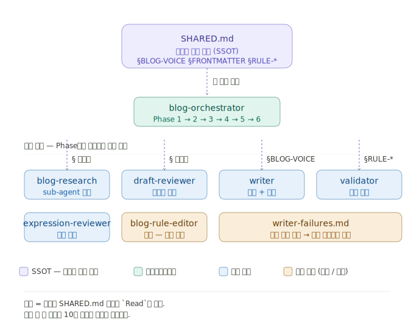
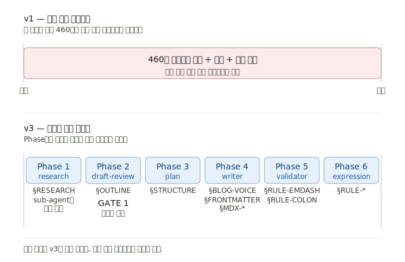
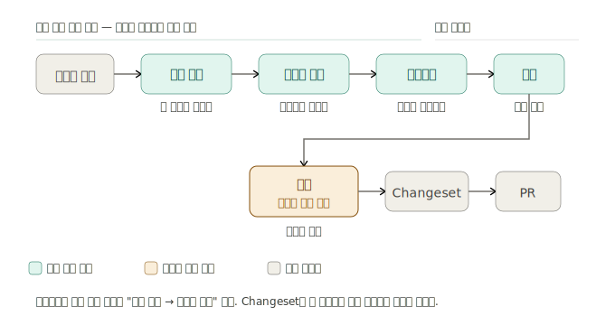
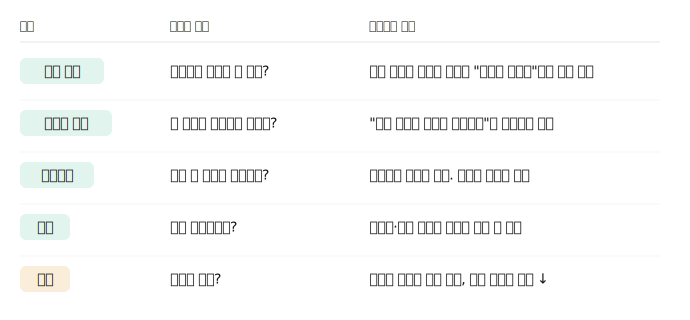

# AI Agent로 개발 생산성과 워크플로우를 개선하는 방법

피드에는 '제 AI 직원들입니다' 같은 화면도 자주 올라옵니다. 저는 그걸 그대로 따라 하기보다, **지금 쓰는 개발 환경에서 에이전트를 어디에 붙이면 생산성이 실제로 나아질지**를 더 오래 들고 있었어요.

링크드인 피드에서 자주 보이는 한 장면.

그 사이에도 [비개발자가 Gemini와 Claude Code로 텔레그램 큐레이션 서비스를 출시했다](https://www.clien.net/service/board/lecture/19174394)는 식의 후기는 어렵지 않게 보입니다.

'누구나 만들 수 있다'는 흐름이 있다는 정도의 배경만 잡고 넘어가면, 개발자 쪽 질문은 다른 모양이에요. 예를 들어 [에이전트에게 사고 과정까지 설계해 넣을 때](https://techblog.gccompany.co.kr/ai-%EC%BD%94%EB%94%A9-%EC%97%90%EC%9D%B4%EC%A0%84%ED%8A%B8%EC%97%90%EA%B2%8C-%EC%82%AC%EA%B3%A0-%EA%B3%BC%EC%A0%95%EC%9D%84-%EC%84%A4%EA%B3%84%ED%95%98%EB%8B%A4-9c7325e4655d) 워크플로가 어떻게 바뀌는지 같은 축이죠.

그래서 제가 붙잡고 있던 문장은 이거였습니다.

> 지금 내가 개발하고 있는 환경에서 AI Agent를 사용하여 개발 생산성을 향상시킬 수 있는 방법은 없을까?

스마일게이트 개발자 커뮤니티(MODAC)에서 문제 해결을 위한 AI 활용 스터디를 진행하면서, 지난 5주 동안 두 가지를 직접 해봤습니다.

하나는 잘 굴러갔고, 하나는 만들어놓고 안 쓰였어요. 이번 사례를 통해 성공과 실패 둘 다 적어보려고 합니다.

## 사례 1 - AI가 글을 쓰는 테크 블로그

처음 시작한 건 한 가지 가설이었습니다.

> AI가 글을 쓰고, 개발자가 방향을 잡는다.

"AI가 쓴 기술 블로그가 실제로 읽을 만한가?"를 직접 검증해보고 싶었습니다. Next.js + MDX + velite 기반의 정적 블로그 환경을 세팅하고, 글 한 편을 처음부터 끝까지 뽑아내는 워크플로우를 만들어 보기로 했습니다.

같은 기간에 디자인시스템, 접근성 패턴 레퍼런스 사이트, 접근성 스펙 크롤러까지 같이 돌리고 있었고, 에이전트를 얹어 본 메인 도구는 **Claude Code**였어요. 아래에서는 블로그 쪽만 깊게 적고, 디자인시스템은 뒤쪽 **사례 2**에서 이어갑니다.

이 프로젝트는 지난 5주 동안 세 번의 큰 구조 변경을 거쳤습니다. 잘 굴러갔던 구조도 시간이 지나면서 한계를 드러냈고, 그때마다 다음 구조로 옮겨갔습니다. 결과만 보면 "처음부터 v3로 가면 되지 않았나" 싶지만, **v1과 v2를 겪지 않았다면 v3가 왜 그렇게 생겼는지 이해할 수 없었을 거예요.** 그래서 세 버전을 차례로 짚어보려고 합니다.

### v1 - 한 Command에 모든 걸 담았을 때

가장 단순한 형태로 시작했습니다. `write-post`라는 **커맨드**(Claude Code의 **Command** — 슬래시 한 번에 묶어 두는 프롬프트 세트)에 글쓰기에 필요한 모든 지침을 적어두고, `/write-post <주제>` 한 줄로 글을 끝까지 끌고 가는 구조였습니다.

자료 수집 우선순위, frontmatter 스키마, 사람처럼 쓰는 방식, 마크다운 함정, 검증 체크리스트까지 - **한 파일이 약 460줄**까지 부풀어 올랐습니다.

처음에는 잘 작동했습니다. 이 단계에서 가장 큰 성과는 글 자체보다 **검증된 가설**이었어요. 직접 뽑아본 글을 읽었을 때 "어, 이 정도면 블로그로 올려도 되겠는데?" 싶은 수준이 나왔고, 그 결과를 근거로 프로젝트를 계속 밀고 가기로 결정할 수 있었습니다.

하지만 곧 한계가 드러났어요.

**프롬프트 후반부가 묻히기 시작했습니다.** 파일이 400줄을 넘어가면서, 앞쪽의 자료 수집 규칙은 잘 지키는데 뒤쪽의 표현 규칙(em-dash 금지, 콜론 헤딩 금지 같은 것들)은 반복적으로 어겼어요. 같은 프롬프트인데 위치에 따라 영향력이 달랐던 거죠.

**작성 외에는 할 줄 아는 게 없었습니다.** 글이 완성된 뒤에 "검증만 다시 돌리기"나 "다듬기만 하기" 같은 작업을 분리할 수 없었어요. 모든 규칙이 한 파일에 박혀 있었기 때문에 새 커맨드를 만들려고 해도 복붙 지옥이 예상됐습니다.

**중단할 수가 없었습니다.** 기획안만 보고 "이 방향 아닌 것 같은데"라고 끊고 싶어도, 한 번 실행하면 끝까지 달려버렸어요.

이 시점의 진단은 단순했습니다. **"역할을 나누면 되겠지."**

### v2 - 네 개의 에이전트로 쪼개기

`post-draft-reviewer`(기획안 검토), `post-writer`(저장), `post-validator`(기계 검증), `post-expression-reviewer`(표현 검토) - 네 개의 **서브 에이전트**(Claude Code의 **Agent** — 메인 세션과 분리된 컨텍스트에서만 도는 역할 단위)로 책임을 분리했습니다.

표면적으로는 v1의 문제가 풀렸어요. 각 에이전트가 자기 책임에만 집중하고, 글 저장 후에 validator만 단독으로 호출할 수 있고, 서브 에이전트는 독립 컨텍스트라 메인 세션이 오염되지 않습니다.

그런데 써보면서 새로운 문제가 줄줄이 나왔어요.

**규칙이 여러 파일에 흩어졌습니다.** em-dash 금지 규칙이 writer에도, validator에도, expression-reviewer에도 따로 적혀 있었어요. 규칙 한 줄을 고치려면 세 파일을 다 찾아 같이 고쳐야 했고, **누락이 실제로 생겼습니다**. 한 곳만 고치고 나머지가 뒤쳐지면 에이전트끼리 모순된 규칙을 가지고 돌아가는 상황이 됐죠. SSOT(Single Source of Truth)가 깨지는 전형적인 패턴이었습니다.

**토큰 비용이 오히려 늘었습니다.** 에이전트마다 입력을 가공해서 다시 넘겨야 하고, 공통 규칙도 각자 품고 있으니 총 프롬프트 크기가 v1보다 커졌어요.

**단계 간 뉘앙스가 증발했습니다.** 독립 컨텍스트가 장점인 줄만 알았는데, 동시에 단점이기도 했어요. 기획 단계의 "이 부분은 가볍게"라는 판단이 writer에게 구조화된 입력으로 떨어지지 않으면 그냥 사라져버렸습니다.

이 시점에 한 문장으로 정리되는 깨달음이 있었어요.

> **역할 분리 ≠ 컨텍스트 분리.**

에이전트 경계를 너무 단단히 세우면 정보가 새나갑니다. 분리된 각자가 "맞는 일을 다른 맥락에서" 하게 돼요. 결국 v2는 v1보다 나은 점이 있었지만, 다른 종류의 한계를 만든 셈이었습니다.

### v3 - Skill 패밀리 + SSOT

v2의 문제가 명확해지니 다음 방향을 찾기 시작했고, 이때 참고한 게 [gstack](https://github.com/garrytan/gstack)이었어요. AI 에이전트 관리 도구의 선두 주자 중 하나인데, 처음 봤을 때 가장 놀랐던 게 **`agents` 폴더가 아예 없었다는 점**이었습니다. 그 자리에 `skills` 폴더가 있고, 몇몇 스킬은 워크플로우 형태를 띠고 있었어요.

처음엔 의문이 들었습니다. **워크플로우를 통째로 스킬로 만들면 컨텍스트가 과도하게 부풀지 않을까?** 이 의문에 대한 답은 잠시 뒤에 다시 다루겠습니다.

우선 이 구조를 우리 프로젝트에 옮겼더니 - 현재의 v3는 SSOT 한 곳(`blog-shared`)과 10개의 **스킬**(Claude Code의 **Skill** — 워크플로를 파일로 재사용하게 만드는 단위)로 구성된 패밀리입니다. 설계는 **두 개의 축**과, 그 축에서 파생된 **세 개의 운영 장치**로 나뉘어요.

#### 두 개의 축 - v2의 두 문제를 정면으로 뒤집기

**SSOT - 규칙은 한 곳에만.** em-dash 금지, frontmatter 스키마, 어조 정의 같은 모든 규칙이 `SHARED.md`에 섹션 ID로 정의되어 있고, 각 스킬은 필요한 섹션만 `Read`로 주입받습니다. 규칙 한 줄 바꾸면 10개 스킬이 동시에 갱신돼요. v2에서 "grep으로 찾아다니다 누락하던" 일이 원천적으로 사라졌습니다.

**메인 컨텍스트 공유 + 선택적 sub-agent.** v2의 "독립 컨텍스트가 뉘앙스를 잃는다"는 문제를 뒤집었습니다. 기본은 메인 세션 실행이고, sub-agent는 자료 수집처럼 **대량 원문이 메인을 오염시킬 때만** 씁니다.

이 두 축이 v3의 정체성이에요. 뒤이어 나올 "1323줄짜리 스킬은 왜 안 터지는가"라는 질문의 답도 결국 이 두 축에서 나옵니다.

#### 세 개의 운영 장치 - 두 축을 실제로 굴리기 위한 부속

**Phase별 명시적 게이트.** **오케스트레이터**(여러 스킬을 Phase 순으로 호출하는 상위 스킬)가 Phase 1~6을 순차 실행하되, 사용자 개입은 GATE 1(기획안 승인) 한 곳만 의무로 두었어요. 나머지 리뷰어들은 블로커를 찾았을 때만 개입을 요청합니다. v1의 "중단 못 함" + v2의 "중단이 애매함"이 한 번에 해결됐어요.

**실패 학습 루프.** writer가 자가 체크리스트를 통과하지 못한 케이스를 `writer-failures.md`에 자동 누적합니다. 3건 이상 쌓이면 알림이 뜨고, 그 패턴을 분석해 **규칙 자체를 개선**하는 흐름으로 이어져요.

**메타 스킬 - 규칙을 고치는 스킬.** 규칙 수정 자체를 스킬(`blog-rule-editor`)로 만들었습니다. 백업, diff 미리보기, SSOT 위반 검사, 영향 범위 분석 같은 7개의 안전 장치를 거치게 했어요. v2에서 "수정 후 영향을 일일이 확인해야 했던" 피곤함이 여기서 풀렸습니다.

### 1323줄짜리 스킬은 왜 안 터지는가

이쯤에서 당연한 의문이 생깁니다. **v1의 460줄 커맨드가 후반부를 놓치던 게 문제였다면, 1323줄짜리 오케스트레이터 스킬은 왜 안 터지는가?**

핵심 차이는 "파일 크기"가 아니라 **"특정 시점에 컨텍스트에 실제로 로드된 토큰"** 에 있었습니다. 한 문장으로 답하면, **컨텍스트가 시간축으로 조각나 있기 때문**이에요. 이걸 받치는 장치가 네 가지입니다.

**하나, 스킬은 자동 로드가 아니라 지연 로드입니다.** v1 커맨드는 실행 순간 460줄 전체가 한 프롬프트로 올라가서 글이 끝날 때까지 내내 살아있었어요. 반면 v3 오케스트레이터는 Phase별로 하위 스킬을 순차 주입합니다. 예를 들어 Phase 4에 도달하기 전까지는 writer의 상세 규칙(620줄)이 컨텍스트에 없습니다.

**둘, Phase 간에는 구조화된 변수만 넘깁니다.** 각 Phase는 이전 Phase의 원문이 아니라 요약된 변수만 받아요. `blog-research`가 수만 토큰짜리 원문을 읽었어도, 오케스트레이터가 받는 건 500~1500 토큰 요약뿐입니다. 원문은 sub-agent 컨텍스트에서 소진되고 버려져요.

**셋, SHARED.md도 필요 섹션만 주입합니다.** 1126줄짜리 SHARED.md를 통째로 로드하지 않아요. writer가 실행될 때는 `§BLOG-VOICE / §FRONTMATTER / §MDX-*`만, validator는 `§RULE-EMDASH / §RULE-COLON-HEADING`만 가져갑니다.

**넷, Sub-agent로 컨텍스트 오염을 차단합니다.** 자료 수집만 sub-agent로 격리해, WebFetch 결과가 오케스트레이터에 흘러들지 않게 일부러 떼놨어요.

정리하면 v1은 "한 번에 460줄 + 본문 전체 + 자료 원문"이 계속 살아있는 **연속 단일 프롬프트**, v3는 "Phase별로 필요한 섹션만 왔다가 사라지는" **조각난 실행 그래프**입니다. 코드 총량은 v3가 훨씬 크지만, **순간 최대 컨텍스트는 오히려 작아요.**

이게 "워크플로우를 통째로 스킬로 만들면 컨텍스트가 터지지 않을까?"라는 초기 의문에 대한 구조적 답이었습니다.

### 그런데 솔직히, 품질은 높았지만 기억되진 않았습니다

여기까지가 v3 구조에 대한 이야기예요. 그러나 시스템이 잘 굴러간다는 것과 **그 결과물이 좋다는 것**은 다른 문제였습니다.

4월부터 운영을 시작해 약 한 달 만에 60편 이상의 글이 쌓였습니다. 직접 읽어봤을 때는 만족스러웠지만, 객관적인 검증이 필요하다고 판단했어요. 그래서 GPT, Gemini, Claude 계열 4개 모델에 교차 평가를 요청했습니다.

네 모델이 공통적으로 짚은 강점은 두 가지였습니다. 하나는 **기술 정확성** - 할루시네이션이 거의 없고 참조 링크가 유효하다는 점. 다른 하나는 **운영 완성도** - 카테고리 구조, SEO 설계, 시리즈 연결성이 단순한 글 모음이 아니라 운영 시스템 수준이라는 평가였어요.

그런데 약점도 명확했습니다.

**실전 경험이 부족합니다.** 실패 사례가 없고, 운영 중 문제 해결 경험이 없고, "왜 이 선택을 했는지" 맥락이 없습니다. 읽히기는 하지만 깊게 남지는 않는다는 평가였어요.

**AI 특유의 반복 패턴이 보입니다.** 비슷한 도입부, 비슷한 문장 리듬, 지나치게 정돈된 구조. 몇 편 연속으로 읽으면 패턴이 드러난다는 피드백이었습니다.

이 평가를 한 문장으로 요약하면 이거예요.

> 좋은 글 자동 생성 시스템은 만들었다. 하지만 아직 사람의 경험이 담긴 미디어는 아니다.

이걸 인정하고 나니 방향이 바뀌었어요. **생산량 중심**에서 **신뢰도와 인상 중심**으로요. 하루 3편씩 찍어내던 걸 줄이고, 실제 사례·장애 경험·선택의 이유를 한 편씩 깊게 다루는 쪽으로 옮기는 중입니다.

이 사례에서 얻은 가장 단단한 한 줄을 적어두자면:

> **파일 총량이 아니라, 순간 컨텍스트를 설계해야 한다.**

그리고 한 줄을 더 붙여야겠어요.

> **자동화가 잘 굴러간다는 것과, 그 결과물이 의미 있다는 건 다른 문제다.**

이 두 번째 문장이 다음 사례 - 디자인시스템 - 로 자연스럽게 이어집니다.

## 사례 2 - 디자인시스템의 비개발자 워크플로우

블로그 자동화에서 얻은 패턴을 다른 프로젝트에도 적용해 보고 싶었습니다. 마침 운영 중인 디자인시스템 프로젝트에 비슷한 페인포인트가 있었어요.

**디자이너가 디자인 토큰을 직접 Git에 반영할 수 있을까?**

기존 대안인 Token Studio는 워크플로우는 좋았지만 자동 Git Sync를 쓰려면 월 8만 원 수준의 유료 플랜이 필요했고, 무료 플랜은 토큰을 단일 파일로 합쳐야 했어요. 우리 팀은 color / typography / spacing처럼 목적별로 분리해 관리하고 있어서 맞지 않았습니다.

그래서 우회 방법으로 **Changeset 자동화 스킬**(블로그와 같은 방식으로 묶어 둔 Skill 워크플로)을 만들기로 했어요.

### 시도 - Changeset 자동화 스킬

디자이너가 단순히 "changeset 만들어줘"라고 요청하면 다섯 단계가 자동으로 돌아갑니다.

1. diff 분석 → 영향 패키지 탐지
2. 버전 bump 추천 (patch / minor / major)
3. 변경 유형 분류
4. 릴리즈 노트 문구 작성
5. changeset 생성 + 커밋

핵심은 **비개발자 친화성**이었어요. 자유 입력 대신 선택지 중심으로 설계해서 semver나 changeset 문법을 몰라도 쓸 수 있게 만들었습니다.

기술적으로는 만족스러웠어요. 비개발자도 몇 번의 선택만으로 배포 준비가 가능하고, CHANGELOG 품질이 균일해지고, 버전 판단이 자동화되고, 커뮤니케이션 비용이 줄어들 가능성이 보였습니다.

### 그런데 아무도 안 썼어요

표면적인 이유는 있었습니다. 디자이너에게 익숙하지 않은 **AX**(Agent Experience — 에이전트와 함께 일하는 사용자 환경) 환경이 눈에 들어왔어요. VSCode나 Cursor 같은 에디터를 써본 적이 없는 상태에서, Claude Code로 코드를 직접 작성·수정하고 GitHub에 푸시까지 하는 과정이 버겁게 느껴졌던 거죠. 결국 이 시점에서는 개발자가 직접 changeset을 작성하는 게 더 효율적이라는 결론이 났습니다.

여기서 "환경이 안 맞으니 어쩔 수 없지" 하고 넘어갈 수도 있었어요. 하지만 한 주 지내고 보니 그 결론이 머릿속에 계속 남아 있었습니다. 정말 그게 이유의 전부였을까?

### 옆에 앉아 보고 알게 된 것

답을 찾으려면 책상에서 추측하는 걸로는 부족했어요. 디자이너 옆에 앉아 시나리오를 따라가봤습니다. 그러다 알게 된 게, **막힌 지점이 `/changeset`을 부르기 직전이 아니었다**는 거예요. 훨씬 더 앞이었습니다.

흐름은 대략 이렇습니다.

1. "버튼이 좀 둥글면 좋겠는데" 생각이 든다
2. Figma에서 토큰을 한번 바꿔본다
3. **개발자한테 "이거 반영해 주세요" 한다** ← 이 메시지를 못 보냄
4. (개발자가 코드에 반영)
5. (개발자가 changeset을 만든다)

내가 자동화한 건 4번과 5번 사이였어요. 그런데 디자이너는 3번에서 멈춰 있었습니다.

3번에서 망설이는 이유를 더 들여다보니 세 가지였어요.

**하나, 영향 범위를 모릅니다.** "이걸 바꾸면 어디까지 영향이 가지?"에 답을 못 해요. border-radius 하나 바꾸겠다는 게 어디까지 번지는지를 본인이 모르는 상태에서 요청을 보내는 게 부담스러운 거죠.

**둘, 본인이 책임지는 변경인지 애매합니다.** 디자인 토큰 바꾸는 게 디자이너의 의사결정 영역인지, 아니면 합의해야 할 사안인지가 안 잡혀 있었어요. "내가 결정해도 되는 일인지"부터 막힙니다.

**셋, 개발자한테 묻는 게 더 빠릅니다.** 위 두 개를 풀려면 본인이 직접 코드를 봐야 하는데, 그럴 바엔 슬랙으로 물어보면 5분 안에 풀려요. 도구를 거치는 것보다 사람한테 묻는 게 비용이 낮은 상황이었던 거죠.

이걸 알고 나니 `/changeset`이 안 쓰인 건 당연했어요. **세 가지 망설임 중 어느 하나도 풀어주지 않는 도구**였거든요. Changeset은 위 세 가지가 다 풀린 다음에야 의미가 생기는 마지막 산출물이었습니다.

블로그 사례에서 얻었던 문장에 한 줄을 더 붙여야 했어요.

> 자동화가 잘 굴러간다는 것과, 그 결과물이 의미 있다는 건 다른 문제다.
> **그리고 자동화의 끝부분만 자동화하면, 시작에서 망설이는 사람한테는 닿지 않는다.**

### 다시 그린 워크플로우 - 결과가 아니라 의도부터

`/changeset`과 `/pr`은 "뭐가 바뀌었는지"를 정리하는 **결과물**이에요. 변경이 다 끝난 다음에 만드는 것들이죠. 그런데 디자이너가 막혀 있던 지점은 그 앞이었습니다.

- 뭘 바꾸고 싶은가
- 어디까지 영향이 가는가
- 바뀐 모습은 어떻게 생겼나
- 이거 진행해도 되나

이 네 가지가 풀려야 changeset이든 PR이든 의미가 생깁니다. 그래서 이번 워크플로우는 결과물을 잘 뽑는 게 아니라, **결과물에 도달하기 전 단계를 명시적으로 거치게 만드는 게 목표**가 됐어요.

그려둔 흐름은 이렇습니다.

뒤의 두 단계는 이미 있고, 앞의 다섯 단계를 새로 만들 영역으로 잡았어요. 그릴 때 신경 쓴 건 **블로그 v3에서 얻은 두 가지 원칙을 그대로 가져오는 것**이었습니다.

**Phase 간에는 구조화된 변수만 넘긴다.** 자연어 입력은 첫 단계(변경 제안)에서 한 번만 정규화되고, 그다음부터는 구조화된 형태로만 흐릅니다. 다음 단계는 이전 단계의 원문을 받지 않아요.

**사용자 개입은 한 곳만 의무.** 다섯 단계라고 디자이너가 매번 멈춰 확인해야 한다는 뜻은 아니에요. 사람의 판단이 필요한 건 **결정** 단계 한 곳뿐이고, 나머지는 막혔을 때만 개입을 요청합니다. 블로그 v3에서 GATE 1만 의무로 두고 나머지는 블로커가 있을 때만 끊는 구조가 잘 굴러갔기 때문에, 같은 방식이 워크플로우 시스템에서도 통할 거라고 봤어요.

각 단계가 디자이너의 어떤 망설임에 답하는지가 핵심입니다.

이 중에서 영향도 분석이 사실상 가장 중요한 단계예요. 디자이너가 막혀 있던 진짜 지점이 거기였거든요. 다른 단계가 다 자동화돼도 영향도 하나가 비면 워크플로우가 안 돌아갑니다.

### 솔직히, 이게 정말 굴러갈지는 모릅니다

여기까지 그리고 보면 그림은 깔끔하지만, 이대로 굴러갈 거라고 확신하지는 않아요. 블로그에서 v1 → v3로 가면서 **처음 그린 설계가 그대로 살아남는 일이 거의 없다**는 걸 충분히 봤거든요.

특히 가장 큰 위험 하나는 미리 적어두려고 합니다.

**디자이너가 이 흐름을 자기 일이라고 느낄까.**

`/changeset`이 안 쓰인 진짜 이유 중 하나는 "개발자한테 묻는 게 더 빠르다"였어요. 이번에 만들 다섯 단계짜리 흐름이 슬랙 메시지 한 통보다 비용이 낮으리라는 보장이 없습니다. 오히려 단계가 많아진 만큼, 잘못 만들면 더 무거워질 가능성도 있어요.

이걸 통과하려면 **각 단계가 디자이너에게 명확한 가치를 줘야 하고**(영향도 분석은 본인이 못 보던 걸 보여주고, 미리보기는 추측 없이 결과를 보여주고), **단계 사이가 끊김 없이 이어져야** 합니다. 그런데 이 두 가지를 책상 위 설계로 풀 수 있을 것 같지 않아요.

그래서 다음 작업 방식 자체를 바꾸기로 했습니다. 만든 다음에 디자이너한테 보여주는 게 아니라, **만드는 중에 옆에 앉아서 같이 굴려보는** 식으로요. 1차 사용자를 1명으로 잡고, 그 사람 워크플로우에 맞게 깎은 다음 확산하는 방향입니다.

## 두 사례를 거치고 남은 것들

블로그는 굴러갔고, 디자인시스템은 멈췄어요. 결과가 정반대였는데도 이상하게 회고하다 보면 같은 곳을 짚게 됐습니다. 본문에 흩어진 깨달음 중에 일반화해도 될 만한 것들만 추려봤어요. 다른 영역에도 통할지는 아직 모릅니다.

### 자동화의 끝부분만 자동화하면 사용자에게 닿지 않더라

디자인시스템 사례에서 가장 단단하게 남은 한 줄이에요.

`/changeset`은 결과물 - 변경 기록을 정리하는 단계 - 를 자동화한 도구였습니다. 그런데 디자이너는 그 단계까지 가지 못하고 있었어요. 영향 범위를 모르고, 본인이 결정해도 되는 변경인지 애매하고, 그럴 바엔 슬랙으로 물어보는 게 빠르다 - 이 세 가지에 막혀서 결과를 만들 일이 시작되지도 않았던 거죠. 결과만 자동화한 도구는 그 앞에서 망설이는 사람에게는 닿지 않았어요.

돌이켜보면 블로그도 같은 구조였습니다. v1이 무너진 건 460줄짜리 결과를 한 번에 뽑으려 했기 때문이었고, v3가 가벼웠던 건 결과를 만들기 전 단계들을 Phase로 명시했기 때문이었어요. 두 사례에서 같은 게 두 번 확인된 셈입니다.

지금은 도구를 만들 때 "이 자동화가 사용자의 여정에서 어느 지점에 놓이는가?" 를 먼저 묻는 버릇이 생겼어요. 마지막 단계인지, 첫 단계인지, 중간인지. 마지막 단계만 자동화하면 그 자동화는 잘 만들어도 안 쓰일 수 있다는 걸 한 번 겪고 나니까요.

### 1323줄짜리 스킬이 460줄짜리 커맨드보다 가벼웠다

이건 좀 더 기술적인 결입니다.

v1의 460줄 커맨드는 실행 순간 한 프롬프트로 전부 올라와서 글이 끝날 때까지 살아있었어요. v3의 1323줄짜리 오케스트레이터는 Phase별로 필요한 섹션만 잠깐 들어왔다가 나갑니다. 코드 총량은 v3가 훨씬 큰데, **순간 최대 컨텍스트는 오히려 작아요.**

이걸 겪기 전까지는 "프롬프트는 짧게 써야 한다"가 머릿속의 단순한 규칙이었어요. 그런데 이건 정확한 규칙이 아니었습니다. 정확한 규칙은 **"특정 시점에 컨텍스트에 무엇이 살아 있어야 하는가"** 였어요. 시간축으로 토큰을 관리한다는 감각이 들어오니까 v2 시절 겪던 문제들이 다 다르게 보였습니다. 같은 규칙이 세 파일에 중복돼 있던 게 문제였던 게 아니라, 그 규칙들이 매번 같은 시점에 다 불려나오던 게 문제였던 거죠.

여기서 따라온 작은 깨달음 하나가 더 있어요. **역할 분리와 컨텍스트 분리는 다른 결정이라는 것.** 에이전트를 쪼개면 컨텍스트도 자동으로 쪼개진다고 막연히 생각했는데, 그게 v2의 모든 문제의 출발점이었어요. 에이전트 경계를 너무 단단히 세우면 정보가 새나가고, 분리된 각자가 "맞는 일을 다른 맥락에서" 하게 됩니다.

### 책상에서 보이지 않던 게, 옆자리에 가서 보였다

디자이너가 `/changeset`을 안 쓰는 진짜 이유는 옆에 앉아서야 보였어요. 책상에서는 "구독이 없어서 그런가" 정도로 추측만 가능했죠. 옆에 앉아서 시나리오를 따라가 보고 나서야 디자이너가 막혀 있던 지점이 도구를 부르기 직전이 아니라 훨씬 더 앞이었다는 걸 알았습니다.

블로그도 비슷했어요. 56편을 운영한 뒤에야 4개 모델 교차 평가에서 "기억되지 않는다"는 평가를 받았어요. 만들기 전에는 보이지 않던 거죠.

두 사례 모두 만드는 단계와 검증하는 단계가 분리돼 있어서 시간이 더 들었어요. 책상에서 다 설계하고 만든 다음에 사용자에게 보여주는 흐름은, 그 사이에 들어간 시간만큼 늦게 알게 되는 구조였습니다.

그래서 앞으로는 작업 방식 자체를 바꿉니다. 1차 사용자를 1명 정해두고, 만드는 도중에 옆에 앉아 같이 굴려보면서 깎는 식으로요. 이 방식이 정말 잘 굴러갈지는 직접 해봐야 알 것 같아요.

## 마치며

도입부에서 던졌던 질문을 다시 꺼내볼게요.

> 지금 내가 개발하고 있는 환경에서 AI Agent를 사용하여 개발 생산성을 향상시킬 수 있는 방법은 없을까?

본문을 거치면서 한 줄씩 붙여나갔던 문장을 모아두면 이렇습니다.

> 파일 총량이 아니라, 순간 컨텍스트를 설계해야 한다.
> 자동화가 잘 굴러간다는 것과, 그 결과물이 의미 있다는 건 다른 문제다.
> 그리고 자동화의 끝부분만 자동화하면, 시작에서 망설이는 사람한테는 닿지 않는다.

지난 5주 동안 두 가지를 직접 해본 결과로 답해보면 - **결과물을 자동화하는 게 아니라, 결과물에 도달하는 흐름을 설계하는 일**이었어요. 이게 책상 위 설계로 끝나는 게 아니라 옆자리에서 검증해야 하는 일이라는 것도 같이요. 짧지만 솔직한 답입니다.

이 두 사례는 [MODAC-Agent](https://github.com/MODAC-Agent) - 스마일게이트 개발자 커뮤니티 후원으로 운영된 "문제 해결을 위한 AI 활용 스터디" 안에서 매주 다듬어졌어요. 주원님이 먼저 시도한 실패 학습 루프 아이디어를 블로그 v3에 가져와 쓴 부분이 있고, 휘찬님과 매주 화요일에 모여 회고하면서 "이건 그냥 쓰고 싶은 도구가 아니라 진짜 쓸 도구인가"를 계속 같이 점검했습니다. 혼자였으면 v2에서 한참 더 헤맸을 것 같아요.

## 참고

**Hooks·Commands·Rules·Agents·Skills** 쪽 개념과 커스텀 방법(훅 스크립트 위치, 커맨드·스킬 예시 등)은 [1주차 리포트](https://github.com/MODAC-Agent/jihyeong-agent/tree/main/week1)에 이미 정리해 두었어요. 이번 글은 그걸 전제로 사례만 깊게 적었고, Commands·Agent·Skill·오케스트레이터는 본문에서 처음 나오는 문장에만 짧게 붙여 두었습니다.
